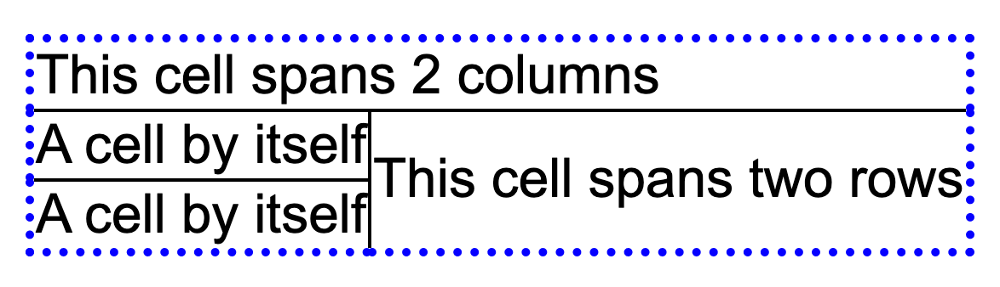

# `<address>`

### What does `<address>` do?
`<address>` should be used for addresses. You guessed that already. But what kind of addresses, and in what context?

Address context
`<address>` was originally used to indicate contact information for the page owner. It has since evolved to include any type of contact information, generally the address of an article author or the address of a website.

- 🔹 If `<address>` is placed within an `<article>`, it is assumed this is the article author's address.

- 🔸 If `<address>` is placed closest to the `<body>` tag, it's assumed to be the website organization's address. Usually this type of information is found in a page `<header>` or   `<footer>`.

### Kinds of addresses

✅ Any information that's used to contact the website organization or the article author is fair game. That might include:

- email addresses

- social media links

- phone numbers

The contact person's name may also be included in an address element.

⛔️ However, non-contact information is to be avoided.

# `<blockquote>` and `<q>`

`<blockquote>` is for block-level quotes, while `<q>` is used for inline quotes. Optionally, these may be paired with either a <cite> element or a cite attribute. (We'll cover <cite> and cite tomorrow, Day 3.)

In other words, a longer quote goes in a `<blockquote>` element, while `<q>` marks shorter passages.

👀 Sounds easy, but it's not as straightforward as you think.

### When to use `<blockquote>`
- ✅ You're quoting an extended passage from a book, article, website, or some other work. By making this passage stand alone, it's clear that this is something you are quoting, not something that you originally wrote.

- ✅ You're quoting what someone said as a report, not as a conversation.

- ✅ Somewhere, there's a citation that could go with this.

### When to use `<q>`
🏁 You're quoting a short passage from a book, article, website, or another work. Typically this is a few words or a line or two. Anything longer should probably use `<blockquote>`.

🏁 It's not a conversation.

🏁 There's a citation that could go with it.

### When not to use `<blockquote>` or `<q>`
- ⛔️ Dialog - if it's a conversation, it's not a quote.

- ⛔️ Sarcasm or "air quotes" - there is a double quote key on your keyboard for these. It's not just for "code."

❌ ❌ ❌ PLEASE do not use `<blockquote>` for indents. CSS is made for indents. Use it.

- ⛔️ Likewise, do not use `<q>` in particular for conversations. It has built-in curly quotes before and after your quotation. They're pretty and tempting. But they are not for your conversation.

- ⛔️ Did I mention that `<q>` is not for conversations?

### Common attributes
👀 `<cite>` and the cite attribute are commonly associated with these elements, for obvious reasons. Your original thoughts or writing are not included in `<blockquote>` and `<q>`. Therefore, a citation is appropriate. (We'll cover `<cite>` and cite tomorrow, Day 3.)

# `<cite>`

`<cite>` is for the title of a work, which can be quoted, referenced in detail, or mentioned in passing. "Works" are books, songs, paintings, programs, TV shows, operas, social media posts, and so much more. If you're referring to something that's not your own, you need to cite it in some way.

How hard could this be? So hard. WHATWG and MDN don't agree on many points, leaving we poor developers in a world of hurt. Let's start where they do agree.

### Titles of works
If it's a creative work, like the title of a book, movie, or exhibition, or the name of an opera, painting, or TV show, use `<cite>` to indicate it as such.

    
Baby Yoda in <cite>The Mandalorian</cite> is the cutest thing ever!
 

🎓 So... not exactly an academic citation, is it? We aren't linking to Disney+, or a website, or any study that has conclusively proved this statement to be true, even though we know it is true.

### Where it gets hard
Let's say we want to properly quote this:

- Who said it: The Client

- TV show: *The Mandalorian*

- Quote: "**Bounty hunting is a complicated profession.**"

- Website source: https://www.starwars.com/news/the-mandalorian-quotes

It's a short quote, so it could be inside of a `<q>` element as part of a sentence, or it could be set off as a more prominent quote in a `<blockquote>` element. Let's demonstrate the `<blockquote>` variation according to WHATWG and MDN.

### WHATWG Example 1
    <blockquote cite="https://www.starwars.com/news/the-mandalorian-quotes">  
       
Bounty hunting is a complicated profession.
 </blockquote> 
    
The Client in <cite>The Mandalorian</cite>
 
WHATWG maintains that the citation should not show up inside of the `<blockquote>`. It should be placed after it. The URL citation is placed as an attribute to `<blockquote>` to associate the URL with the quote.

### WHATWG Example 2
    <figure>
       <blockquote cite="https://www.starwars.com/news/the-mandalorian-quotes">
         
Bounty hunting is a complicated profession.

       </blockquote>
       <figcaption>The Client in <cite>The Mandalorian</cite></figcaption> 
    </figure> 
This methodology associates the quote with who said it from where more strongly. (We'll talk about `<figure>` as part of the Multimedia Extravaganza toward the end of this month.)

By the way, if you feel like both of these examples make no sense, we sympathize. We are reporting their rules, not our agreement with them.

### MDN Example
    <blockquote>
       
Bounty hunting is a complicated profession.

       <footer>The Client in <cite><a href="https://www.starwars.com/news/the-mandalorian-quotes">The Mandalorian</a></cite></footer> 
    </blockquote> 
This might be closer to what you've seen others do before. Here the character who said it and the creative work are referenced inside the `<blockquote>`. The URL is in a clickable link, although it could be referenced via the cite attribute if a clickable link was not desired for some reason.

### Common attributes
Cite may also be an attribute within:

`<blockquote>` and `<q>` (discussed in Day 2)

`<del>` and `<ins>` (discussed in Day 12)

The value for the cite attribute is only a URL reference. It's not flexible about its content as the `<cite>` element is.

The cite attribute, when paired with `<blockquote>` or `<q>`, is particularly important when used with the WHATWG methodology of quoting, where the person who said it or the work are not included within the `<blockquote>` or `<q>` element. The *cite* attribute would therefore connect the URL reference to the thing that was said, since no other method is possible with their rules.

But again, we are open to instruction from anyone who can explain this more clearly than we can.

# `<dfn>`

`<dfn>` is used to indicate the term being defined within the context of a definition phrase or sentence.

That means we'll look to the nearest or surrounding `
`, `<dd>` within a definition list (tomorrow!), or `<section>` element (Day 18) for the definition of the term.

### Ways to use `<dfn>`
The most obvious usage is to indicate the term being described within the context of the phrase or sentence. Here, "Godzilla" is defined by the rest of the paragraph.

    
My son thinks he is <dfn>Godzilla</dfn>, who is generally depicted as an enormous, violent, prehistoric sea monster awakened and empowered by nuclear radiation. It's true, there are similarities.
 

If we mention the definition again later in our content, we can add a bookmark link to jump back to the term nearest to the definition.

    
He is not as enamored with <dfn id="kong">King Kong</dfn> who resembles an enormous gorilla-like ape that has appeared in various media since 1933. 
 
    
    ...
    
    
Complaints about <a href="#kong">Kong</a> include how he has no atomic fire breath.
 
One common -- and useful -- combination is to pair `<dfn>` with `<abbr>` (the abbreviation tag, appearing in an email near you on day 7) in order to define a term along with an acronym.

    
<dfn><abbr title="Massive Unidentified Terrestrial Organism">MUTO</abbr></dfn> refers to a species of giant monsters that first appeared in <cite>Godzilla</cite> (2014) and <cite>Godzilla: King of the Monsters</cite> (2019). In <cite>Godzilla vs. Kong</cite> (2021), the enemy has changed.
 

### Little known facts about `<dfn>`
Both MDN and WHATWG say that if `<dfn>` has a title attribute, the attribute MUST contain only the term and no other text. Our thought is that this could be for a nickname, rather than an abbreviation, otherwise, it's unclear in the documentation what the difference is!

    
In the Godzilla-verse, <dfn title="Ghidorah">Monster Zero</dfn> is a giant extraterrestrial three-headed dragon-like monster.
 
If you are using a `<dl>` (Day 5, tomorrow!) as a DEFINITION list, then it's acceptable and perhaps even desirable to double tag the term with `<dfn>`. (Spoiler alert: `<dl>` may also be a description list!)

    <dl>
       <dt><dfn>Monster Island</dfn></dt>
       <dd>Island where Godzilla lives</dd>
       <dt><dfn>Skull Island</dfn></dt>
       <dd>Island where Kong lives</dd>
    </dl>
### Common attributes
Common attributes include *title* and *id*, as explained earlier.

# Description lists and `<dl>`, `<dt>`, `<dd>`

Today we focus on the three elements that make up a description list, historically called the definition list: `<dl>`, `<dt>`, and `<dd>`.

While ordered `<ol>` and unordered `<ul>` lists are made of a series of **single items**, a description list has **pairs of information**. If there is a RELATIONSHIP between the term and the details, then you can technically use a description list.

The meaning of each tag is as follows:

- `<dl>` description list (or definition list)
- `<dt>` description name (or definition term)
- `<dd>` description details (or definition)

(*The above would be best marked up with a definition list. Unfortunately, we cannot access the Substack code to make it so. Yep, we’re as guilty of bad markup as anyone else.*)

Typically, a description list might be used with many types of information:

- 📚 Author and book title(s)
- 📷 Location and photographer
- 🕸 Website and description
- 🎪 Date and event
- ❓(Frequently Asked) Question and answer

You might also use it for some specific metadata at the start of an article or a recipe.

### Examples of a description list
A more general use is as a description list. Here we have two stores and things to purchase at each one:

    <dl>
       <dt>Target</dt>
         <dd>dish soap</dd>
         <dd>socks</dd>
       <dt>Fresh Thyme</dt>
         <dd>coconut water</dd>
         <dd>strawberries</dd>
         <dd>aged gouda</dd>
    </dl> 

The classic use as a definition list consisting of terms and definitions still works. It's lovely. Don't forget to include the <dfn> tag as appropriate!:

    <dl>
       <dt><dfn>Target</dfn></dt>
       <dd>Chain of stores selling clothing, electronics, health supplies and general household items</dd>
       <dt><dfn>Fresh Thyme</dfn></dt>
       <dd>A Midwestern grocery store chain in the United States</dd> 
    </dl> 
### Duplicating terms and descriptions
As shown above, you may have more than one `<dt>` for a `<dd>`, and you may have more than one `<dd>` for a `<dt>`.

If you have multiple `<dt>` elements in a row, it's assumed these are all names for the same thing.

If you have multiple `<dd>` elements in a row, it's assumed these are all possible descriptions for the term(s) immediately preceding the description.

### Little known fact about description lists
WHATWG is permitting `
` elements inside of `<dl>` now for two purposes: styling and for holding microdata elements.

    <h3>Grandma's Apple Pie</h3>
     <dl>
       

         <dt>Preparation time</dt>
         <dd>1 hour</dd>
       

       

         <dt>Baking time</dt>
         <dd>45 minutes</dd>
       

       

         <dt>Oven temperature</dt>
         <dd>350 degrees</dd>
       

     </dl>

# `
` and `
`

`
` is a wrapper for a `
` sentence or term and its longer explanation that begins collapsed. By clicking on a triangle next to the summary, we reveal a longer explanation.

🪗 It's the EASIEST WAY TO MAKE AN ACCORDION MENU! 🪗

True, animation effects to smooth out the transition are not available, but in a pinch, we think you'll find you love this tag as much as we do! 💕

### Example
The details/summary combination is perfect for information similar to a definition list, but which might have a series of items that stand alone, rather than grouped in list format:

    

       
Reading the fine print

       
This is where we hide all of the secret terms and conditions. Your mileage may vary.
 
    
 
The `
` element is optional. Without it, you'll get the default clickable text which says "details." The `
` element must also be the first child of `
`. Include it as the very first thing inside the `
` element.

### Little known facts about `
` and `
`
- ⛔️ The details element is not appropriate for footnotes. Seems like it would be a great fit, but unfortunately, it's not. See WHATWG for more information.

- ⛔️ There is currently no way to control the animation between the summary being hidden and revealed.

- ✅ The `
` element is used nowhere else in HTML. It may only be used with `
` and only as a first-child of `
`. How's that for a specific element?

### Common attributes
By including the open attribute in the `
` element, the element will appear open by default on the page, rather than closed:

    

       
About My Life

       
My life is as open as this details panel.
 
 
When a summary is opened, an open attribute is added to details. This attribute may be used to style each state. [The below example is from WHATWG](https://html.spec.whatwg.org/multipage/interactive-elements.html#the-details-element):

    details > summary {
    transition: color 1s;
    color: black;  
    }
    details[open] > summary {
    color: red;  
    }

# `<abbr>`

**TLA: three-letter acronym.*

`<abbr>` is for abbreviations or acronyms. If you're using them in your writing, well, you should define them. Your teacher told you this in school, and we're telling you again for your HTML.

### How `<abbr>` works
A good web starts with well-written content. Erika and Jen speak English in the United States, and this is our bias in the below advice. Modify the below advice to fit with grammar rules and conventions for your language and country.

✅ If you learned to write papers in the US, you know that the first time you use an acronym or abbreviation, you should define it, unless it's extremely well known.

    
We are excited to see where NASA takes us next, given their many successes on the Moon and Mars.
 
To a US-based audience, we are so familiar with NASA, we may not know exactly what NASA stands for (or care, to be honest). However, it is an acronym, and we can mark it up as such:

    
We are excited to see where <abbr>NASA</abbr> takes us next, given their many successes on the Moon and Mars.
 
Yeah, not super helpful. We already guessed it was an abbreviation or acronym of some kind, but we still don't know what it stands for.

✅ If you want to communicate the words behind the NASA acronym, there are two possibilities. We like this methodology, which combines good English writing practices with HTML:

    
We are excited to see where the <dfn id="NASA">National Aeronautics and Space Administration</dfn> (<abbr title="National Aeronautics and Space Administration">NASA</abbr>) takes us next, given their many successes on the Moon and Mars.
 
See how we combine `<dfn>`, which defines the abbreviation, with `<abbr>`? The ID in `<dfn>` may be used to link to that definition later in the document. (See Day 4 for details.)

The title attribute in `<abbr>` also tells us what the NASA acronym means, but the meaning is hidden. You may have seen this show up as a dotted line in some browsers, with a tooltip that appears when one hovers over the link. That's nice, but now one must do some work to see what the abbreviation means, rather than reading it in the sentence. Also, what happens if you're on a device that doesn't hover? That situation is nicely addressed above through content and markup.

However, if you're working with an abbreviation or acronym that is well-known, and not many people might need help with knowing what this is, you may leave the definition in the title attribute for the `<abbr>` element.**

    
We are excited to see where <abbr title="National Aeronautics and Space Administration">NASA</abbr> takes us next, given their many successes on the Moon and Mars.
  
***Many of Jen’s current and former students now hear her voice in their heads: “Just because you can doesn’t mean you should…”*

## Common misconceptions

### Deprecated `<acronym>` element
⛔️ Older HTML specifications included a separate <acronym> element, which is now deprecated. While there is a difference between acronyms and abbreviations, developers aren't that picky about the *semantic* difference.

### Differences in display across browsers
⛔️ Some of these older browsers (IE in particular) don't style `<abbr>` the same way that our favorite browsers do (a dotted underline plus tooltip). As always, check across browsers for consistency in styling.

### Don't go crazy with `<abbr>`
✅ Even the specifications state that not every instance of an abbreviation or acronym requires an `<abbr>` tag. Consider that Dr. is an abbreviation for "doctor" - would you seriously mark that up every time it occurs in medical documentation? We think not. Apply `<abbr>` judiciously. Don't go bananas.

### Commonly used attributes
We described the title attribute in detail earlier:

    <abbr title="National Aeronautics and Space Administration">NASA</abbr>
The title attribute, when associated with the `<abbr>` element, must contain the definition of the acronym or abbreviation and nothing else.

### [`<abbr>` demo](https://codepen.io/jen4web/pen/XWpaqmm?editors=1100)

# `<small>`

Read the Fine Print. It's become an art form in American society. Legal disclaimers, copyright notices, terms and conditions, privacy notifications, and so much more. It's all of those sticky details that must be disclosed, but companies like to keep hidden.

Those disclaimers and details are printed in tiny type to minimize printing costs and discourage detailed reading. We can do the same on the web!

### A brief history of `<small>`
Back in the Dark Days Before CSS, `<small>` was used for... small text! As in, text that's not big. That was for the `<big>` element, of course.

⛔️ Then we got wise, separated presentation from markup, and `<small>` was tossed in the great 😠 *Dustbin of Frowned-Upon Elements* 😠 for several years during HTML4 and XHTML 1.0.

✅ HTML5 brought back `<small>` with its new meaning, while it deprecated `<big>`. In the new definition, `<small>` is the fine print. As [MDN](https://developer.mozilla.org/en-US/docs/Web/HTML/Element/small) says, copyright, legal text, and side-comments are all candidates for `<small>`.

### When to use `<small>`
✅ If it's a brief passage of "fine print," as an exception to the rest of the page's content, `<small>` is a great choice.

    
<small>&copy; 2021 by me. All rights reserved, baby.</small>
 
⛔️ If it's an extended passage of fine print, like the pages containing the full privacy policy, terms and conditions, or other disclaimers of use, don't repeat `<small>` over and over again. On those pages, the fine print is the focus of the page, not the exception to it.

✅ `<small>` may also be used to indicate limitations on an offer.

    
Today only: $10 off your purchase! <small>must purchase $1000 or more</small>
 
### Common misconceptions about `<small>`
⛔️ WHATWG cautions against using `<small>` as the "opposite" of strongly emphasized (`<strong>`) or emphasized (`<em>`) text:

The small element does not "de-emphasize" or lower the importance of text emphasized by the em element or marked as important with the strong element. To mark text as not emphasized or important, simply do not mark it up with the em or strong elements respectively.

👀⚠️ Finally, always ask yourself if you're using `<small>` for styling or if you're using it to convey specific meaning. If it's styling, use CSS. 👀 ⚠️

### [A `<small>` demo](https://codepen.io/jen4web/pen/OJWjomB)

# `<wbr>` and &shy

As developers, we tend to ignore some of the nice styles that print designers have tweaked in their work for years. For example, we don’t often modify kerning, leading, widow/orphan control, or hyphenation in our sites. Nor do we tend to think much about a paragraph of information that wraps onto multiple lines. Where exactly are the line breaks occurring? How do we make the rag look even?

*[8 Simple Typography Tips For Your Designs from Smashing Magazine](https://www.smashingmagazine.com/2009/04/8-simple-ways-to-improve-typography-in-your-designs/)*

But the designers among us will be super happy to know that we have some control over the rag using `<wbr>`, the word break tag, and `&shy;`, the "shy" hyphen.

### What does `<wbr>` do?
Long words don't automatically hyphenate on the web. What's more, for developers trying to make text look good on the range of screen sizes we support, inevitably marketing and/or the designers will find that ONE ANNOYING SCREEN where it looks bad and harp on it endlessly. Not that we have ever personally experienced this.

    
Somewhere out there, on some screen, this sentence will look awful because of <dfn>sesquipedalianism</dfn>, a love of long words.
 
We suppose you could do some JavaScript magic to address this problem. But you know what's coming next. The content writers complain that the hyphens are in the wr-on-g spot.

<wbr> performs an essential public service in indicating where word breaks might occur as set by a human.

    
Somewhere out there, on some screen, this sentence will look awful because of <dfn>ses<wbr>qui<wbr>pe<wbr>dal<wbr>ian<wbr>ism</dfn>, a love of long words.
 
*(We may have over-<wbr>-ed in this example.)*

✅ This breaks up sesquipedalianism in the right spots, and the breaks appear only if needed. See the [CodePen demo](https://codepen.io/jen4web/pen/bGgYERj) for <wbr> in action.

⛔️ The next problem is "BUT WAIT THERE IS NO HYPHEN." Correct. `<wbr>` does not provide you with a hyphen. This may be helpful for those occasions where a break is needed but a hyphen is not desired.

For example, have you ever styled a long URL on a page? (University peeps: citations, amirite?) `<wbr>` handles this well without adding extra characters. See the [CSS Tricks article](https://css-tricks.com/better-line-breaks-for-long-urls/) that will walk you through this.

### What does `&shy;` do?
✅ You guessed it already! A "shy" hyphen is a hyphen that appears only when needed.

    
Somewhere out there, on some screen, this sentence will look awful because of <dfn>ses&shy;qui&shy;pe&shy;dal&shy;ian&shy;ism</dfn>, a love of long words.
 

### CSS-based typography properties
HTML is for markup, so there's not much else we can do with `<wbr>` and `&shy;` in #30DaysofHTML.

However, there are many well-supported CSS properties that also control other aspects of typography. It's more than Google Fonts.

What's more, if browsers don't support these CSS properties, you are no worse off than you would be if you didn't include them. That's progressive enhancement at its finest!

- Widow/orphan control (Firefox doesn't support widows and orphans. Ponder that for a minute, you monsters.)

- CSS hyphenation (works great for English, not so great in other languages)

- CSS columns to shorten line lengths for improved reading

- CSS word breaks to prevent words from overflowing their container

- [Type scales](https://type-scale.com/) for well-proportioned type

And others!

### [`<wbr>` and `&shy;` demo](https://codepen.io/jen4web/pen/bGgYERj)

# `` and ``

If you're a fan of footnotes, certain abbreviations, exponents, or chemical formulas, you're familiar with superscripts and subscripts. Superscripts are the ones that go up, and subscripts go down. Shockingly, these characters may be marked up in HTML using the `` and `` elements.

⚠ 👀 As always, these HTML elements should not be used for CSS styling purposes. They are intended to communicate meaning. E=mc2 means that we’re multiplying mass x the speed of light x 2, while E=mc``2`` means the speed of light is squared (and then multiplied by mass). Important difference.

### Superscripts with ``
Superscripts are the ones that go up. You'll find them used as exponents and some kinds of lettering, among other cases.

    
Which way to 4th Street?
  
    
    
The Pythagorean Theorem says that a2 + b2 = c2.
 

### Subscripts with ``

Let's say we want to write some markup for Jen's favorite Valentine poem ever. 
*(Did you know she was a biology major/chemistry minor in college? Science is her love language.)*

The markup for this poem would look like this:

    
Roses are angiosperms 
     Violets are too 
     Sugar is C12H22O11 
     We know this from peer review
 

### Bonus: MathML
✅ You might be wondering about the boundaries between these simple HTML superscripts and subscripts and full-fledged scientific and mathematical formulas. If you're writing complex equations, you might want to look into [MathML](https://developer.mozilla.org/en-US/docs/Web/MathML), the math markup language. It's made for long division, fractions, and of course, superscripts and subscripts, among many other elements.

### A misconception on MDN
⛔️ MDN combines footnotes with subscripts. We have not seen this formatting often in the wild. Wikipedia likes superscripts for footnotes, as do most manuals of style.

### [`` and `` demo](https://codepen.io/erika4web/pen/zYNpogP?editors=1100)

# `<s>`, `<mark>`, `<ins>`, and `<del>`

Four elements in one day! It's a lot for one email, but there are several themes that tie these elements together.

〽️ `<mark>` draws attention to specific text. Its default styling is a yellow highlight.

🪧 `<s>` is for strikethrough. This is designed for information which has changed, but you still want to see what was there previously. It includes a line through the text by default.

✔️ `<ins>` is specifically for editing, adding text to the document. It's underlined by default. Ugh.

❌ `<del>` is specifically for editing also, indicating that text was removed from the document. It also has a line through it by default.

Why combine these in a single day? `<s>` and `<del>` are very similar in their purpose and need further explanation. `<ins>` and `<del>` are for editing specifically. `<mark>` might be the easiest to explain, but it has similar accessibility issues to the other elements, so it makes sense to present this at the same time.

### `<mark>`: Draw attention

Sometimes you need to draw attention to certain text. That text is relevant, but perhaps not important enough to justify `<strong>` or `<em>`.

    
<strong>Warning</strong>: Drinking too much coffee may lead to <mark>sleepless nights</mark>.
 
You may also use `<mark>` in a quotation (`<blockquote>` or `<q>`) to bring attention to certain parts of a passage that might not have been emphasized in the original text.

    <blockquote cite="https://www.amazon.com/gp/product/1568302894/">
       
<cite>Creating Killer Web Sites</cite> is the first true design book for the Web. ...you'll find this book invaluable for all aspects of design: ... <mark>why you should avoid using most standard HTML tags</mark>... 

       <footer>Description of <cite>Creating Killer Websites</cite> by David Siegal (1996)</footer> </blockquote> 
`<mark>` may also be used to identify search terms in a page of search results.

Other use cases are listed at [MDN](https://developer.mozilla.org/en-US/docs/Web/HTML/Element/mark) and [WHATWG](https://html.spec.whatwg.org/multipage/text-level-semantics.html#the-mark-element).

### `<s>`: Indicating information has changed
Sometimes things change. Prices increase or decrease. Tickets and featured restaurant entrees get sold out. We make silly comments and think better of them, but still want to leave the silly comment. `<s>`, the strikethrough element, is appropriate for all of these.

    
Purchase a ticket for <s>$100</s> <s>$50</s> $10!
 
In other words, **this isn't for editing**. We want you to be aware that things have changed, and that's part of the story we're telling.

### `<ins>` and `<del>`: Editing with HTML
The concept of tracking changes is found in document editors, databases, websites, and GitHub. Why not HTML? Sure, why not!

That's what `<ins>` (insertion) and `<del>` (delete) are for. These indicate permanent changes to the document. Or at least, permanent enough for now.

    
John's current employer is <del>Google</del> <del>Microsoft</del> <ins>Yahoo</ins>.
 

⛔️ By default, browsers draw a line through deleted text (just like `<s>`) and 😠 underline 😠 the inserted text. Yuck. As a result, many developers use CSS to change these default stylings to a GitHub-like pale red `<del>` and pale green `<ins>`, paired with a symbol to indicate addition and subtraction of content. See [MDN's CSS pane](https://developer.mozilla.org/en-US/docs/Web/HTML/Element/ins) for an example of this (with added + and - symbols for accessibility).

### Want even better examples of these?
✅ ✅ ✅ We strongly recommend John Rhea's article at CSS Tricks, [Copyediting with Semantic HTML](https://css-tricks.com/copyediting-with-semantic-html/). Bravo!

### Why we grouped these four elements: Accessibility considerations
Even though these four elements communicate semantics, they are not necessarily recognized and read by screen readers. For example, someone using a screen reader would hear all of those prices read out loud:

    
Purchase a ticket for <s>$100</s> <s>$50</s> $10!
 
becomes, `“Purchase a ticket for $100 $50 $10!”`

Indeed, in the MDN documentation for each element, there's a section with a similar CSS-based solution for this issue. (They vary only in the value of the content property.) For example, [here is the suggestion for `<s>` from MDN](https://developer.mozilla.org/en-US/docs/Web/HTML/Element/s#accessibility_concerns):

    s::before, s::after {
    clip-path: inset(100%);
    clip: rect(1px, 1px, 1px, 1px);
    height: 1px;
    overflow: hidden;
    position: absolute;
    white-space: nowrap;
    width: 1px;
    }
    s::before {
    content: " [start of stricken text] ";
    }
    s::after {
    content: " [end of stricken text] ";
    }
The first declaration visually hides the text generated by the second and third declarations, which is intended to be aural content for screen readers.

✅ ✅ ✅ We strongly recommend [Adrian Rosseli's Tweaking Text-Level Styles](https://adrianroselli.com/2017/12/tweaking-text-level-styles.html) for more detailed information about how this works.

### Commonly used attributes for `<ins>` and `<del>`
It's lovely that we know information was inserted or deleted. But when? And why? That is what the datetime and cite attributes are for.

As you might guess, *datetime* is for... time and date? But not in just any format. [Use the standardized time and date formats for HTML](https://developer.mozilla.org/en-US/docs/Web/HTML/Date_and_time_formats#date_strings). This format needs an email/blog post by itself, and we'll talk about it further when we get to <time> in a few days.

We know the cite attribute is for URLs when used with `<blockquote>` or `<q>` (Day 3), but what about `<ins>` and `<del>`? Fortunately, it's the same. Specify a URL where you might track bugs or other changes where someone might get a more detailed explanation about the change.

    
John's current employer is 
    <del datetime="2015-06-01" cite="https://www.example.com/resume.html">Google</del>  
    <del cite="https://www.example.com/resume.html"  datetime="2017-01-08">Microsoft</del>  
    <ins cite="https://www.example.com/resume.html"  datetime="2020-03-06">Yahoo</ins>.
 
Once again, because *cite* and *datetime* are attributes, neither is displayed on the website by default, either overtly or as a tooltip. You might use CSS or JavaScript to expose these if desired. Also, even though our example uses both attributes together, you may use them individually.

### [`<mark>`, `<s>`, `<ins>` and `<del>` demo](https://codepen.io/jen4web/pen/KKaQdgM?editors=1010)

# `<code>` and `<pre>`

If you want your code to star on the page instead of behind the scenes, then hitch your wagon to the `<code>` and `<pre>` tags.

By default, your browser will ignore any white space between tags, and condense any white space in text into a single space. This is useful for code, poetry, and code poetry.

    
   
    An amoeba named Max and his brother
         Were sharing a drink with each other;
    In the midst of their quaffing,
         They split themselves laughing,
    And each of them now is a mother. 
    
 
Even if we were to add   tags at the end of each line, [an appropriate use of the break tag](https://developer.mozilla.org/en-US/docs/Web/HTML/Element/br), the zig-zaggy tabbing effect would be gone.

### `<pre>` for pre-formatted text
If we want to preserve white space, then wrapping our content in `<pre>` keeps the formatting -- that includes blank lines, tabs and more than one space in a line.

`<pre>` is useful for displaying:

💻 computer code where the spacing is important

📧 written communication with specific white space formatting, like an email, poem or letter

🎨 all of your totally rad ASCII art

    <pre>
              .,-;-;-,. /'_\
            _/_/_/_|_\_\) /
          '-<_><_><_><_>=/\
     jgs    `/_/====/_/-'\_\
             ""     ""    "" 
    </pre> 

### Accessibility and images
You know about the importance of alt attributes with images. This provides a text-based description of the image. So what happens when we have ASCII art in a `<pre>` element? Well, we still need a text equivalent. MDN suggests using the `<figure>` element for this. (We'll discuss `<figure>` in the Multimedia Extravaganza unit towards the end of the month.)

    <figure role="img" aria-labelledby="turtle-caption">
    <pre>
              .,-;-;-,. /'_\
            _/_/_/_|_\_\) /
          '-<_><_><_><_>=/\
     jgs    `/_/====/_/-'\_\
             ""     ""    "" 
    </pre>  
    <figcaption id="turtle-caption">
           The raddest baddest turtle ever seen in ASCII art.
    </figcaption> 
    </figure> 

### `<code>` for inline code
The more semantic `<code>` element can be used in two ways. First, use it inline within other lines of text:

    
<code>turtle</code> is a Python library that enables users to command a turtle to draw pictures on a virtual canvas. We can use functions like <code>turtle.forward()</code> and <code>turtle.right</code> which can move the turtle around.
 
If you have multiple lines of code to display, `<code>` may be nested in `<pre>`:

    <pre>
     <code>
     # Python Turtle program to draw star
     import turtle
     star = turtle.Turtle()
     for i in range(50):
         star.forward(50)
         star.right(144)
     turtle.done() 
     </code>
    </pre> 
By default, both of these tags are rendered in your browser in a monospace font, meaning each character takes up the same width on the screen. This is how code is usually displayed, so you can just leave it as is, or adjust using CSS, depending on your content.

### We’re running a little long
👀 If your `<pre>` content lines are long, you might run into an issue with the content being cut off in narrow views. [Example 4 in the CodePen demo](https://codepen.io/jen4web/pen/PoWQpKp) models these options.

### Option 1: Do nothing
The content will get cut off if the window is too narrow.

### Option 2: Wrap the content
CSS-Tricks points out that we could add:

    pre { white-space: pre-wrap; }
Pre-wrap will wrap the content and helpfully preserves pre-formatted whitespace.

### Option 3: Add a scrollbar
Or alternatively, allow content to be accessed by a horizontal scrollbar:

    pre { overflow-x: auto; }
For more helpful tips for formatting wide content, including an easy way to add color formatting to your code snippets using a lightweight JS library called [Prism](https://prismjs.com/), see CSS-Trick's [Considerations for Styling the pre Tag](https://css-tricks.com/considerations-styling-pre-tag/).

### An interesting attribute
If your `<code>` contains computer code, there isn't a readily available attribute to indicate the coding language. The main recommendation, encouraged by WHATWG, but not mentioned by MDN, is to use a class with a prefix of "language-".
    
    <pre>
     <code class="language-python">
     # Python Turtle program to draw a Rainbow Benzene
     import turtle
     colors = ['red', 'purple', 'blue', 'green', 'orange', 'yellow']
     t = turtle.Pen()
     turtle.bgcolor('black')
     for x in range(360):
         t.pencolor(colors[x%6])
         t.width(x/100 + 1)
         t.forward(x)
         t.left(59) 
     </code>
    </pre> 
Erika thinks this goes against what CSS is used for, unless your Python code happens to be styled differently than your JavaScript code on the page. Erika would be more likely to use a data element as in `<pre data-language="python">` because most screen readers will read out the text of a `data-` attribute. If you have insights on this, [please comment in the discussion](https://jen4web.substack.com/p/code/comments).

### [`<code>` and `<pre>` demo](https://codepen.io/jen4web/pen/PoWQpKp)

# `<kbd>` and `<samp>`

Yesterday we talked about displaying your code and other pre-formatted text on the website using `<code>` and `<pre>`. Today, we're all about the documentation - what happens when someone runs your code? What do they press on the keyboard or say via voice interface, and what is the output?

### `<kbd>`: Program Input

If there are keys to be pressed on the keyboard, or commands to be said by voice, they should be marked up. There's a few ways of doing this, though.

### Keys marked up individually
    
Windows users will use the keyboard shortcuts using <kbd>Ctrl</kbd>,  
    while Mac users will use  <kbd>Command</kbd> instead.
 
Pretty straightforward. You can also use this same markup if the keys are to be pressed together:

    
On Windows, press <kbd>Ctrl</kbd> + <kbd>C</kbd> to copy.
 
However, if you check [today’s CodePen demo](https://codepen.io/jen4web/pen/MWJQmZK), you’ll see that the + may look a bit different than the Ctrl and C above. That’s because via browser default styling, `<kbd>` uses a monospace font. It’s likely the rest of that paragraph does not, so you’ll see differences in size and styling.

### Grouping keys
You may also group keys together in a unit. This fixes that styling problem mentioned above, and it may better communicate that the keys are pressed as a unit.

    
On Windows, press <kbd><kbd>Ctrl</kbd> + <kbd>C</kbd></kbd> to copy.
 

### Voice commands
They're more and more common these days. If you have a voice command, you can mark that up with `<kbd>` too, since that is your interface with the device.

    
Just say <kbd>Alexa, what's the weather like?</kbd> to get a weather report for your area.
  

### `<samp>`: What did the computer say?
When reporting computer-generated messages, use the `<samp>` element.

    
I tried to install WordPress, but the screen said <samp>500 Internal Server Error</samp>.
 

### Combining elements

🥪 It may also be helpful to combine several of these elements while writing documentation. Both `<code>` and `<samp>` in the below example will render within the `<pre>` box. In this case, we're looking at our code plus the output generated from that code.

    <pre>
       <code class="language-javascript">
          console.log("Hello, world!");
       </code>
       <samp>
          Hello, world!
       </samp> 
    </pre>

### Like peanut butter and jelly

🥪 `<kbd>` and `<samp>` go together like peanut butter and jelly — they were made for each other. [CSS-Tricks has a great article on how these elements work together](https://css-tricks.com/html-elements-unite-the-voltron-like-powers-of-combining-elements/#keyboard-sample-and-variable), as well as other hard-working element teams (like `<abbr>` and `<dfn>`, or `<cite>` and `<blockquote>`, covered earlier).

### [`<kbd>` and `<samp>` demo](https://codepen.io/jen4web/pen/MWJQmZK)

# `<var>`

If you are referencing math or programming, or writing out a math equation, the variables in those expressions can be wrapped in a `<var>` element.

The browser will often render the variable as italicized by default, but like with many things on the web, it depends.

### Examples using `<var>`
✅ <var> is useful when you are discussing your programming:

    <pre>
      <code>
        for(let i = 0; i<10; i++) {
          console.log(i); 
        }
      </code>
    </pre>  
    
This code loops over an index position, <var>i</var>, and prints out
    all of the numbers from 0 to 9.
 
✅ Or when writing out a simple math formula:

    
The area of a circle can be found by multiplying pi times the radius
    squared, which we can write as π<var>r</var>2
 
❓Not much is written about <var>. It really is a simple element! But our feeling is that it can be used in conjunction with `<code>`, `<pre>`, `<kbd>` and `<samp>` as needed.

### Reminder about writing math
If you need to write out a lot of math, like you're Matt Damon in Good Will Hunting, then WHATWG and MDN both suggest considering the [MathML](https://developer.mozilla.org/en-US/docs/Web/MathML) standard, which is essentially special XML tags for math equations.

### [`<var>` demo](https://codepen.io/erika4web/pen/gOgewqm?editors=1000)

# `<time>` `<time>` `<time>`

✅ `<time>` identifies 24-hour clock times, as well as Gregorian calendar dates. It may also be used for a time duration.

⛔️ Time has many confusing formats across programming languages and other standards. That's where all of the potential issues are, not in the HTML itself.

There are no fewer than [58 examples of how `<time>` might be formatted in the WHATWG documentation](https://html.spec.whatwg.org/multipage/text-level-semantics.html#the-time-element).

### `<time>` in the HTML sense
✅ `<time>` indicates where time is occurring in your text, including dates, times, and durations.

Let's identify the time elements in this paragraph of text:

    
The last in-person conference I attended was ConFoo in Montreal,
    Canada. It was held <time>February 26</time> to <time>February 28, 
    2020</time>. There were at least <time>7 1/2 hours</time> of sessions 
    each day. I flew home on <time>Saturday at 1:03PM</time>.
 
While these time cues are understandable to humans, they are not machine-readable. The above paragraph would fail validation for this reason.

⚠️ Either the text in between the `<time>` tags must be machine-readable as defined in the spec, or we'd need to use the datetime attribute. And let's be honest - no humans want to read machine-readable formats, so it’s all about datetime.

    
The last in-person conference I attended was ConFoo in Montreal, 
    Canada. It was held <time datetime="2020-02-26">February 26</time> to 
    <time datetime="2020-02-28">February 28, 2020</time>. There were at 
    least <time datetime="PT7H30M">7 1/2 hours</time> of sessions each day. 
    I flew home on <time datetime="2020-02-29T13:03">Saturday</time>.
 

### Formatting common time
The following formats may be used as content in `<time>` or as the value of a datetime attribute.

- **Year-month-day**. Year or day are optional.

- **Hour:minute:seconds**. Seconds are optional and may include a decimal.

- **Year-month-day hour:minute:seconds** OR **Year-month-dayThour:minute:seconds**. There must be either a T or a space between the date and the time for machine parsing.

### Other types of time to format
[Look them up if you need them.](https://html.spec.whatwg.org/multipage/text-level-semantics.html#the-time-element)

- Time zones and time zone offsets

- Global date and time strings

- Week numbers (like 2021-W17)

- A duration string (like 8h, or 2h 12m 16s, or PT2H12M16S)

### Other uses of time
Don't confuse `<time>` with three possible `<form>` inputs and two elements:

- `<input type="time">`, specifically for hours and minutes (seconds optional)

- `<input type="date">`, specifically for year-month-day

- `<input type="datetime-local">`, specifying a date and a time in a single input.

- `<ins>` and `<del>`, as discussed recently, also use the datetime attribute.

All of the above elements use the same date and time formatting used for `<time>` and *datetime* as values.

### [`<time>` demo](https://codepen.io/jen4web/pen/OJWZBxj?editors=1000)

# `<noscript>`

Only a handful of people deliberately disable JavaScript in their web browser these days. However, events that result in no access to JavaScript still transpire: your multi-megabyte JavaScript file fails to download, CDNs go offline, someone’s corporate network blocks something, or network errors happen.

**What happens if there is no JavaScript?** What does your site visitor see? Sometimes, it's nothing at all... the White Screen of Death.

Now, clearly you should be a good enough programmer to have mechanisms in place to recover gracefully if something fails along the way. But as a final remedy, <noscript> is there to provide content when nothing else works.

[*Smashing Magazine*](https://www.smashingmagazine.com/2018/05/using-the-web-with-javascript-turned-off/) does a great job of explaining these scenarios and examining major sites and their fallbacks for when there is no JavaScript.

### Understanding `<noscript>`
It's pretty simple. `<noscript>` shows up on the page when JavaScript fails for whatever reason.

If JavaScript writes 100% of your page, then `<noscript>`'s content might be the only thing you'd see in JavaScript's absence.

If JavaScript writes less than 100% of your page, you'd see anything that doesn't rely on JavaScript to display, but the JavaScript effects would fail and any content placed in `<noscript>` would display instead.

    <noscript>
        <h2>Something bad happened</h2>
        
You, dear user, did nothing wrong. But something failed, 
            and the page did not load correctly.

         <!-- maybe tell the user what to do next? --> 
    /noscript> 
When JavaScript is active, that text will not display.

### Use `<noscript>` in the `<head>` or `<body>`

`<noscript>` may be used in the `<head>` of the document, not just the `<body>`. If you need different `<link>`, `<style>`, or `<meta>` tags if JavaScript doesn't load, you may include those there.

    <head>
       <noscript>
         <!-- this CSS loads when all of the CSS I stuffed in my JavaScript doesn't -->
         <link href="realcss.css" rel="stylesheet">
       </noscript>
    </head> 

### Twitter is using `<noscript>`
As Smashing Magazine pointed out, Twitter uses `<noscript>` on their site. However, their implementation has changed since 2018, when the article was written. Visit Twitter in the browser of your choice and view source for a tweet or your feed. Lines 48-125 show a `<noscript>` implementation that include both embedded CSS and a little HTML. It’s a mini-web page inside of a web page!

Previously, according to the Smashing Magazine article, Twitter used a meta-refresh element inside of `<noscript>`:

    <noscript>
       <meta http-equiv="refresh" content="0; URL=https://mobile.twitter.com/i/nojs_router?path=%2F">
    </noscript>

That implementation will redirect the user from the current page to whatever information you want the user to have when JavaScript isn’t available.

### Accessibility considerations
`<noscript>` is indeed accessible, assuming its contents are also accessible. However, as WebAIM points out:

⚠️ *`<noscript>` is an alternative to scripting, NOT an alternative for inaccessibility.*

# `<section>` and `<article>`

We're starting our new unit on parts of the web page. You have probably heard of these elements before. You may even have a sense of what they do. But unfortunately, they seem to be missing on many web pages. 👀

Web page parts are more than `<head>` and `<body>`, no? We remember the bad old days of `
` and `
` and soooo many `
`s because we had no other options. Thank goodness we have semantic tags that help us identify the parts of our web pages.

Rather than spending a bunch of time showing you how to code with these elements -- which you already know -- let's focus instead on their meaning and proper use. It's all driven by the content.

## `
` vs `<section>` vs `<article>`
All three of these elements contribute no styling to the page in their default format. So why does it matter so much which one you choose? Because element choice communicates meaning and intention behind the scenes to screen readers, search engines, and many other robots and machines coming your way in the future.

### `<article>`
`<article>` is the most specific of these. An `<article>` is a piece of content that could stand on its own without any other supporting materials and still be understandable. As [MDN](https://developer.mozilla.org/en-US/docs/Web/HTML/Element/article) and [WHATWG](https://html.spec.whatwg.org/multipage/sections.html#the-article-element) say, candidates include "a forum post, a magazine or newspaper article, or a blog entry, a product card, a user-submitted comment, an interactive widget or gadget, or any other independent item of content."

While there are no specific requirements for types of content in an article, it will generally contain a headline and supporting text. 🖥 See the CodePen demo for an example.

### `<section>`
A <`section>` contains related content that may or may not stand on its own. It may be a section of blog articles, a section of comments, a section of images. In today's common web design patterns, it might be a jumbotron or hero banner, the three boxes describing your product, or the row with the testimonials in it.

Like articles, sections usually have a heading inside of them.

[In a recent *Smashing Magazine* article](https://www.smashingmagazine.com/2020/01/html5-article-section/), Bruce Lawson recommends combining `<section>` with an appropriate ARIA label for better compatibility with screen readers.

`
`
A `
` is the most generic item of the bunch. It's useful for holding a CSS class or JavaScript *data-* attributes without adding anything to the page's meaning.

✅ `
` should, ideally, be your **last choice** for marking up parts of your web page, rather than your first.

### Where it gets complicated
üß© All of these elements nest inside of each other. You already knew that about `
`. It’s also true with `<article>` in `<article>`, `<section>` in `<section>`, `<section>` in `<article>`, and `<article>` in `<section>`. No one wants to see that here, so look at 🖥 the [CodePen demo](https://codepen.io/erika4web/pen/QWdBGmO) for an example.

### Determining the right element to use
There are other parts of the page we'll cover in the coming days, including `<main>`, `<aside>`, `<nav>`, `<header>`, `<footer>`, and the proper use of `<h1>`-`<h6>` in setting up your pages. However, we find that our students most commonly confuse the use of `<article>`, `<section>`, and `
`.

✅ We think it's fair to say that all `<article>` elements might be `<section>` elements, and all `<section>` elements might be `
` elements. However, the reverse is not true. A Venn diagram might be appropriate.

### Related or syndicated?
You could also ask yourself: Related or syndicated?

✅ If the items are related, and they should be grouped as such, that's a `<section>`.

✅ If the item would stand alone in a syndicated format, it's an `<article>`.

✅ If it’s neither, it might be a `
`, or it might be one of the additional elements we’ll cover in the coming days.

### [`<article>` and `<section>` demo](https://codepen.io/erika4web/pen/QWdBGmO)

# `<main>` and `<aside>`

Continuing with the theme of elements you probably already know, but you may not be using correctly, let's look at `<main>` and `<aside>`. They are studies in opposites, which makes them fun to consider together.

### What's your `<main>` focus?
If it's the main focus of the page, the part of the page that holds the meaning for your visit or the app that visitors want to use, that's the part that should be in a `<main>` element.

`<main>` is different than `<article>` or `<section>` in that **there can only be one** `<main>` element per page.

Inside of `<main>`, you may have article(s), section(s), application(s), or anything else that is **unique** to this particular page. Think of `<main>` for the page focus, rather than as identifying a specific type of content. It's not structural, in other words. It's not for repeated elements of any kind (think logos, nav bars, advertising, related articles, etc.).

If your website were a textbook, your `<main>` focus would be the black text on the white background, not the black boxes (those are `<aside>` most likely). This might also be an `<article>` structurally speaking, but its focus is the `<main>` point of the site.

### As an `<aside>`...

In theater, an aside is when an actor talks to the audience about what's going on. In *The Office*, it was often Jim talking to the camera, helping us understand what's going on.

In a magazine or other printed content, an aside is often styled as a pull quote or other content separated from the rest of the page and maybe highlighted in some way. The information may be related to the main text, but it's not its focus.

In your HTML, an `<aside>` is anything that's supporting material for your web page.

In this textbook (see image above), the `<aside>` would be the black boxes. It's related material, helping us understand the focus of the rest of the page, whether that's marked up with a `<main>`, `<article>`, or `<section>`.

⚠️ Sidebars and pull quotes are most commonly mentioned in conjunction with `<aside>`. **However, just because your design contains a right (or left) column for your page doesn't necessarily mean it's an `<aside>`**. That would be letting design drive your element choices, and we know that design is all about CSS, not HTML.

### "Skip links" and accessibility
One of the commonly mentioned items about accessibility and main content is including a so-called "skip link" in your web design. This is a simple internal page link, visible to screen readers but not necessarily exposed in the site design, that allows a "skip" from the top of the page to the main content when clicked.

    <a href="#main">Skip to main content</a>
    ...
    <main id="main"> 
✅ [CSS-Tricks offers a great article](https://css-tricks.com/how-to-create-a-skip-to-content-link/) with more details about this type of link and how to style it for compatibility with screen readers while maintaining invisibility on your site.

### More than one `<main>`?
⚠️ You may have more than one `<main>` element in use per page, *provided only one `<main>` is visible at a time*. [WHATWG](https://html.spec.whatwg.org/multipage/grouping-content.html#the-main-element) has an example of this. Otherwise, one `<main>` per page.

### Things to avoid with `<aside>`
⛔️ Do not use the `<aside>` element to identify text in parentheses, as this kind of text is considered part of the main flow.

### [`<main>` and `<aside>` demo](https://codepen.io/erika4web/pen/ZELjmxg?editors=1000)

# `<nav>`

`<nav>` is for navigation. You knew that. But still, we're horrified by the markup we see as "navigation" these days. We can do better.

What `<nav>` is for
Both [MDN](https://developer.mozilla.org/en-US/docs/Web/HTML/Element/nav) and [WHATWG](https://html.spec.whatwg.org/multipage/sections.html#the-nav-element) state that `<nav>` is for "major navigation blocks" on the site. What might that mean?

 - ✅ Your main navigation bar, usually located somewhere near the top of the page.

- ✅ Sub-navigation for the page, maybe in a left column.

- ✅ A table of contents for longer documents.

- ✅ An index.

### What `<nav>` isn't for
 - ⛔️ Links in the footer to terms and conditions, privacy policy, etc. This isn't "major" navigation. Still, mark this up as an unordered list.

 - ⛔️ Every link that goes anywhere on your page.

### Marking up navbars
- ✅ Navigation is a list of links. Although the marketing people deeply care about what order they links are listed in, they could be visited in any order. With that description, you know exactly how a navbar should be marked up.

        <nav>
           <ul>
             <li><a href="#">Home</a></li>
             <li><a href="#">About</a></li>
             <li><a href="#">Contact</a></li>
           </ul> 
        </nav> 

This produces a vertical navbar by default. CSS makes it go whatever way you want.

### ⛔️ This is not a navbar.
    <nav>   
        <a href="#">Home</a> 
        <a href="#">About</a> 
        <a href="#">Contact</a> 
    </nav> 

### ⛔️⛔️This is even worse.

    
   
        <a href="#">Home</a> 
        <a href="#">About</a> 
        <a href="#">Contact</a> 
    
 

### CSS Hamburgers
Are you a "hamburger menu" fan? It's possible to build this using only CSS, using the `:target` pseudoclass (not the checkbox trick!).

[📚 Responsive, Pure CSS Off-Canvas Hamburger Menu](https://medium.com/@heyoka/responsive-pure-css-off-canvas-hamburger-menu-aebc8d11d793)

Jen's 🎥 [Advanced CSS Layouts](https://frontendmasters.com/courses/advanced-css-layouts/) course at Frontend Masters covers this technique as well (subscription required).

### [`<nav>` demo - making nav bars horizontal](https://codepen.io/jen4web/pen/dyNqMKx?editors=1100)

# `<header>` and `<footer>`

`<header>` is for the top of your web page, while `<footer>` is for the bottom. Yup, you guessed it - not that simple! Just as we learned with `<address>` back on Day 1, the placement of `<header>` and `<footer>` is critical to communicating meaning.

### The Rules of `<header>` and `<footer>`
There are lots of common characteristics between `<header>` and `<footer>` in terms of what is permitted and how they are used.

⛔️ These elements may not contain themselves or each other. In other words, no `<header>` in `<footer>` or `<footer>` in `<header>`; no `<header>` in `<header>`; no `<footer>` in `<footer>`. Furthermore, neither `<header>` nor `<footer>` may appear in `<address>`.

✅ When these elements appear close to the `<body>` and `</body>` tags, it's assumed these elements are the `<header>` and/or `<footer>` for the document. (This is similar to `<address>`.)

✅ When these elements appear in a `<section>` or `<article>`, it is assumed they are they `<header>` and/or `<footer>` for that `<section>` or `<article>`.

✅ `<header>` and `<footer>` are never required, but they are convenient and helpful for organizing the beginning and ending of pages and documents.

### `<footer>` in other places
✅ We already saw how `<footer>` is an option to use in a `<blockquote>` following the MDN example back in our `<blockquote>` and `<cite>` posts.

    <blockquote>
        
Bounty hunting is a complicated profession.

        <footer>The Client in 
            <cite>
                <a href="https://www.starwars.com/news/the-mandalorian-quotes">The Mandalorian</a>
            </cite>
        </footer>  
    </blockquote>

Also, `<footer>` is not exclusively limited to the bottom of a document. WHATWG’s example shows `<footer>` marking up a return to the home page:

    <body>
     <footer><a href="../">Back to index...</a></footer>
     <hgroup>
      <h1>Lorem ipsum</h1>
      <h2>The ipsum of all lorems</h2>
     </hgroup>
     
A dolor sit amet, consectetur adipisicing elit, sed do eiusmod tempor incididunt ut labore et dolore magna aliqua.

     <footer><a href="../">Back to index...</a></footer>
    </body>

### How complicated is this?
For `<header>` and `<footer>`? Not too bad. But headings, as in `<h1>` to `<h6>`, assigning these correctly, and that little `<hgroup>` element in that previous example? That can be a nightmare. (Also, please don’t send mean tweets over `<hgroup>`.) Explained tomorrow, we promise!

Today’s CodePen demo also has a lot of comments in it, explaining our placement of headings, headers, footers, articles, and more.

### [`<header>` and `<footer>` demo](https://codepen.io/erika4web/pen/rNjqBjG?editors=1000)

# Headings and their proper use

You know headings, from `<h1>` to `<h6>`. You know your friends in accessibility tell you to get these in the right order and "don't skip levels." Perhaps you know what this means, but you're not sure if you're doing it right. Also, what about subheadings and some of the crazy things designers do these days with little text and big text? It's a mess.

### What you should never do
⛔️ ⛔️ ⛔️ **Never choose a heading based on the size of the text**. CSS can make your text any size you want. With that out of the way...

### Understanding sequential heading levels
Headings aren't hard to understand when we're talking about one linear article.

    <article>
       <h1>All about fruit</h1>
       ...
       <h2>Citrus fruits</h2>
         <h3>Oranges</h3>
         <h3>Lemons</h3>
       <h2>Apples</h2>
       <h2>Stone fruits</h2>
         <h3>Peaches</h3>
           <h4>Cling Peaches</h4>
           <h4>Freestone Peaches</h4>
         <h3>Plums</h3>
     </article> 
Cling peaches are part of peaches, which are part of stone fruits, which are part of fruit in general. Apples are also part of fruit in general, but are not related to freestone peaches. If we diagrammed the heading relationships, it would look like this:

When your accessibility friends tell you "don't skip levels," **this is what they're talking about**. We have a smooth flow of information from broad to narrow through our document.

### But pages aren't like this
Pages, however, are broken into little pieces. It may be easy enough to get the headings to flow through the article. But what about the `<aside>` in the sidebar? Headings associated with testimonials or navigation? How are all of these numbered?

### Solution 1: Each section has its own numbering
One possible solution is to have each section of the page contain its own heading numberings. (In this case, "section" refers to sectioning content -- elements like `<article>`, `<section>`, `<aside>`, and so forth.) With this solution, it's possible that each section starts with `<h1>`.
    
    <body>
       <header>
         <h1>My Fine Website</h1>
       </header>
       <article>
         <h1>Article title</h1>
       </article>
       <aside>
         <h1>Aside title</h1>
       </aside>
       <section>
         <h1>Section title</h1>
       </section>
       <footer></footer>
    </body> 

**Advantage:** reordering these sections of the page becomes easy, because we do not need to change headings. Easy for *you*. **But good user experience**?

**Disadvantage:** There are a bunch of `<h1>` elements, and depending on who you speak with, this may or may not be an issue. Also, is that a good user experience?

### Solution 2: There is one `<h1>` for the page, and everything else numbers from there

This is the more common approach on most websites, and in our opinion, it provides a better user experience. There is a widespread belief that Google penalizes sites for more than one `<h1>`. **This is not true** (see video below). There are also reports of issues with screen readers misunderstanding a document full of `<h1>` elements. However, other reports seem to think this is not an issue. We are not screen reader experts, and we welcome comments from those who are.

    <body>
       <header>
         <h1>My Fine Website</h1>
       </header>
       <article>
         <h2>Article title</h2>
       </article>
       <aside>
         <h3>Aside title</h3>
       </aside>
       <section>
         <h2>Section title</h2>
       </section>
       <footer></footer> 
    </body> 

The above structure would imply that My Fine Website, the site identity, is the most important item on this page. The `<article>` and `<section>` are all weighted equally in importance, with the `<aside>` slightly less so.

### The `<hgroup>` controversy and subheadings, subtitles, and taglines
🤷🏿‍♂️ How does one mark up things like subtitles, subheadings, and taglines? There are no specific elements for this. If the title gets the heading, what does the subheading get?

### WHATWG: Use `<hgroup>` which is totally a thing
[According to WHATWG](https://html.spec.whatwg.org/multipage/sections.html#the-hgroup-element), `<hgroup>` is an element that should group headings to indicate they are related to each other. Emphasis is given to the highest number in the group, and the lowest number is not considered another implicit section of the page (as happens with most headings).

    <hgroup>
       <h2>Before You Code</h2>
       <h3>Validate Your Idea, Plan Your Product, and Iterate Your Way to Success</h3> 
    </hgroup> 
Here, this would indicate that "Before You Code" is a title of some kind, and perhaps the `<h3>` is a subtitle or tagline. **The `<h3>` does not implicitly start a new section of content when it is inside of the `<hgroup>` element**. In contrast, in the fruit example above, those headings **do** implicitly start a new section of the `<article>`.

### MDN: `<hgroup>` is deprecated so don't use it
[From MDN's `<hgroup>` explanation](https://developer.mozilla.org/en-US/docs/Web/HTML/Element/hgroup):

> "However, given that a key purpose of the <hgroup> element is to affect how headings are displayed by the outline algorithm defined in the HTML specification—but the HTML outline algorithm is not implemented in any browsers—then the <hgroup> semantics are in practice only theoretical.
> 
> So the HTML5 (W3C) specification provides advice on how to mark up Subheadings, subtitles, alternative titles and taglines without using `<hgroup>`."

### W3C's recommended markup
MDN's `<hgroup>` page points us to the W3C, [which has other recommendations for tricky multi-heading markup](https://www.w3.org/TR/html52/common-idioms-without-dedicated-elements.html#common-idioms-without-dedicated-elements) where no dedicated elements exist.

Let's take a common example seen online these days. The designer wants this:

❓ We have 3 important leading lines of text before this article begins. The middle one has the big text in the design. Does that mean it should also get the major heading?

✅ Hopefully, you said, "It depends," which is always the right answer in these situations.

Of the three lines of text in that graphic before the main text begins, which is the most important? Probably "What We Do," because that first line of text explains, “Our aim is to ensure that the financial services sector has the talent and skills it needs” and the last line in the heading says, “Building skills in financial services.” We may even argue that "Collaborate/Retain/Develop" isn't the most important line of text, even if it's the largest. It’s a modifier to the main message: we build skills in financial services.

Therefore, one way to mark this up might be as follows (assuming we have an `<h1>` elsewhere on the page):

    <article>
      <header>
         <h2>What We Do</h2>
         
Collaborate / Retain / Develop

         
Building skills in financial services
 
      </header> 
      
Our aim is to ensure...

    </article>
This follows [Example 4 in the W3C suggestions](https://www.w3.org/TR/html52/common-idioms-without-dedicated-elements.html#common-idioms-without-dedicated-elements).

Alternatively, following WHATWG's recommendation, it might look like this:

    <article>
      <hgroup>
         <h2>What We Do</h2>
         <h4>Collaborate / Retain / Develop</h4>
         <h3>Building skills in financial services</h3> 
      </hgroup> 
      
Our aim is to ensure...

    </article>
Here, the most important item gets the H2, with items of lesser importance ranked accordingly. Style the text to look the same as the W3C example.

⚠️ ⚠️ ⚠️ It’s worth noting that we have no connection with the Financial Services Skills Commission, nor are we familiar with their services. We are marking up the text from our outsider’s viewpoint. If the commission disagrees as to the importance of each line of text, then clearly the markup should change to reflect what they are trying to communicate. ***After all, that is what HTML is all about: identifying the structure of the web page and the purpose of each piece of information***.

### The old `<h1>` controversy

🤷🏿‍♂️ How many `<h1>` elements should you have on a page? A better question is what problem are you trying to address?

👀 If you think multiple `<h1>` elements is bad for SEO, and that’s the reason you avoid doing it, Google says otherwise.

*Basically, whatever you put on a page, Google will find a way to consume it. People write crappy code of all kinds. Google deals with it.*

**✅ The better question regarding H1s is that of accessibility, usability, and the message your site is trying to communicate, rather than SEO considerations.**

As mentioned above, we recommend using headings for sectioning your page and its importance. Chances are that a page of `<h1>`'s makes no sense. But then, a page of nothing but `<h2>` and `<h3>` may also not make sense.

### [Headings demo](https://codepen.io/erika4web/pen/VwPEgRN?editors=1000)

# Day 22: `<table>` , `<tr>`, and `<td>`
## Tables are not the root of all evil 👹

The web was invented by Dr. Tim Berners-Lee, a physicist who wanted to share his scientific research over the internet. It's no surprise that tabular data was among the information he wished to share, and indeed, [tables were part of the very first HTML specification around 1993](https://www.w3.org/MarkUp/HTMLPlus/htmlplus_39.html).

But then some ugly things happened, and tables are something of a swear word in HTML. They shouldn't be, when they're used correctly.

### A brief and ugly history of tables

In 1995, David Siegal wrote one of the first web design books called "[Creating Killer Web Sites](https://www.killersites.com/killerSites/core.html)". It was highly influential at the time, and it contained instructions about how to use HTML tables to lay out web pages.

[Even though CSS was first described in 1994](https://www.w3.org/Style/CSS20/history.html), CSS integration with browsers was always one step behind. It would not be until roughly 2004 when the first basic CSS properties, mostly font-related, could be reliably used across browsers. Layout took much longer.

Furthermore, until Flexbox and Grid came along, we had no reliable and responsive CSS layout methodologies for full web pages. Tables were the first hack in this regard, later displaced by the float hack. Absolute and relative positioning were available but weren’t designed to lay out full web pages.

Therefore, from roughly 1995-2004, tables were the only reliable option for layout. Nine years is a long time to ingrain some habits, so the transition to float-based layouts was hard. (Many of Jen’s PHP developer friends still mourn the loss of table-based layouts to this day.)

Unfortunately, the message conveyed to those new to the field was that tables should never be used for anything, rather than to use tables for tabular data. Tables were unfairly tossed into the 😖Dustbin of Frowned-Upon Elements😖 for a few years. For some developers, they remain there to this day.

Unfortunately, the message conveyed to those new to the field was that **tables should never be used for anything**, rather than to use **tables for tabular data**. Tables were unfairly tossed into the 😖*Dustbin of Frowned-Upon Elements*😖 for a few years. For some developers, they remain there to this day.

### `<table>` for tabular data

✅ If it goes in a spreadsheet, it should go in an HTML table. Data is made for a table.

⛔️ CSS Grid is for layouts.

**Over the next few days, we'll look at how to mark up your data correctly**. For now, let's start with the minimum tags you'll need to start a table.

### `<table>`, `<tr>`, `<td>`
To start a table, use the <table> element. You don't need any attributes (although these were common back in the day).

`<tr>` designates **table rows**, while `<td>` designates table cells, or the table data.

Interestingly, there are no columns called out specifically in a table.

In its most basic format, a table might look like this:

    <table>
       <tr>
         <td>Date</td>
         <td>Time</td>
         <td>Temperature</td>
       </tr>
       <tr>
         <td><time datetime="2021-04-22">April 22</time></td>
         <td><time datetime="11:00">11 AM</time></td>
         <td>50&deg;F/10&deg;C</td>
       </tr> 
    </table> 
🖥 [In today's Example 2 in CodePen](https://codepen.io/erika4web/pen/XWpyExo), we have another example with more rows and columns.

## `<td>`: *colspan* and *rowspan*
Back in the day, when tables were our workhorse for layout and there was little (or no) CSS for styling, there were a zillion attributes for colors, alignments, widths and heights, borders, and much more. Nearly all of these have been deprecated.

colspan and rowspan, assigned to the `<td>` element, are two that remain. As you might guess, colspan is about spanning columns, while rowspan is about spanning rows.

    <table>
       <tr>
         <td colspan="2">This cell spans 2 columns</td>
         <!-- because the above td spans 2 cells, this td is not present -->
       </tr>
       <tr>
         <td>A cell by itself</td>
         <td rowspan="2">This cell spans two rows</td>
       </tr>
       <tr>
         <td>A cell by itself</td>
         <!-- the second td position is occupied by the previous rowspan -->
       </tr> 
    </table> 
The resulting table would look like this, with a 2px border added to the `<td>` for styling purposes:

The confusing part of *colspan* and *rowspan* is tracking which `<td>` elements are not needed on the next row or column. This gets trickier with increasing numbers of cells spanning columns and/or rows.

### Styling tables
Using the above table example as our HTML, styling in a table is truly minimal by default:

Table rendered with no styling is very difficult to read.
Adding the following CSS:

    table {
        border: 2px dotted blue;
    }
    td {
        border: 2px solid black;
    } 

Here we have a border around each cell, plus a border around the table itself. There is a tiny gap between each cell. To get rid of this, add a border-collapse property to the table:

    table {
        border: 5px dotted blue;
        border-collapse: collapse;  
    }
    td {
        border: 2px solid black;
    } 

Why is the outside border dotted blue from the `<table>` instead of solid black from the `<td>` after border collapse? The `<table>` border is 5px wide, while the `<td>` border is 1px wide. The fatter border wins. If they’re exactly the same width, the `<td>` wins. (Try changing border widths in one of the tables in today’s 🖥 [CodePen demo](https://codepen.io/erika4web/pen/XWpyExo).) We don’t need it anymore, so we’ve removed it.

    table {
        border-collapse: collapse;
    }
    td {
        border: 2px solid black;
    } 

To keep the text from butting up against the black borders, add padding on your `<td>` elements.

    table {
        border-collapse: collapse;
    }
    td {
        border: 2px solid black;
        padding: 0.5rem;
    } 

Finally, by default, `<td>` has their contents aligned horizontally to the left and vertically to the middle. You may wish to align their contents to the top of the cell for maximum readability.

    table {
        border-collapse: collapse;
    }
    td {
        border: 2px solid black;
        padding: 0.5rem;
        vertical-align: top;
    }

### [`<table>`, `<tr>` and `<td>` demo](https://codepen.io/erika4web/pen/XWpyExo)

# `<caption>` and `<th>`

To this point, we've looked at the three basic elements in tables: `<table>`, `<tr>`, and `<td>`. If you use only these three elements, you're already creating more semantic content than you would be using `
` and CSS Grid. However, we can still do better! There are more elements designed for tables that will boost accessibility and communicate more meaning about your data.

`<caption>` is all about communicating the overall purpose of your table, and `<th>` is for table headings for rows and/or columns.

### Understanding `<caption>`

In an academic or scientific publication, when a table of data is presented, it always has some type of explanation to go with it. Often the data is given a name, like "Table 1" or similar, along with a brief explanation of what the data is and where it comes from.

`<caption>` is the element for that purpose. `<caption>` may only be placed inside of `<table>`, and **it may only be the first child within the `<table>`**. Do not put your `<caption>` anywhere else.

    <table>
      <caption>Table 1: Date, time, and temperature recordings in 
    Watertown, Massachusetts</caption>
      <tr>
        <td>Date</td>
        <td>Time</td>
        <td>Temperature</td>
      </tr>
      <tr>
        <td>April 22</td>
        <td>11 AM</td>
        <td>50 deg F/10 deg C</td>
      </tr>
    </table>

### Summarizing summaries

Occasionally you may have a table that needs more explanation about what's going on inside of it. This may be for accessibility purposes or for general understanding of complicated tables. [The WAI presents four different ways to include these longer descriptions on their site](https://www.w3.org/WAI/tutorials/tables/caption-summary/#summaries-for-more-complex-tables):

- ✅ Including the summary inside the `<caption>` element.

- ❓ Using aria-describedby, which may not be supported by all screen readers.

- ❓ Using `<figure>` and `<figcaption>`, which presents other problems for some screen readers detailed in the article.

- ⛔️ Using the summary attribute for `<table>`, which has been deprecated in HTML5.

In summary, if there's a description to include regarding your table, put it in `<caption>`.

### Styling `<caption>`
Using CSS, you may make the `<caption>` appear wherever you like.

    caption {
    caption-side: bottom;
    }
The [*caption-side* property in CSS](https://developer.mozilla.org/en-US/docs/Web/CSS/caption-side) is only for use with the `<caption>` element or associated selectors targeting captions. top and bottom are the most common values.

`<caption>` may also leverage all of the usual CSS properties you know and love, so change fonts, colors, sizing, and so forth as you normally would.

### Understanding `<th>`
`<th>` is for table headings. Table headings may occur at the top of columns, at the start of rows, or both. If it's a heading row in your spreadsheet, it should use `<th>` in your HTML.

By default, `<th>` elements are bold and centered. As always, CSS may be used to adjust this.

Revisiting our example, we've changed the `<td>` elements in the first row to `<th>` elements, as these are headings for the data that comes underneath. [This is in WCAG compliance for accessibility](https://www.w3.org/WAI/tutorials/tables/one-header/#table-with-header-cells-in-the-top-row-only), according to the W3C's Web Accessibility Initiative (WAI).

    <table>
      <caption>Table 1: Date, time, and temperature recordings in Watertown, Massachusetts</caption>
      <tr>
        <th>Date</th>
        <th>Time</th>
        <th>Temperature</th>
      </tr>
      <tr>
         <td><time datetime="2021-04-22">April 22</time></td>
         <td><time datetime="11:00">11 AM</time></td>
         <td>50&deg;F/10&deg;C</td>
       </tr> 
    </table> 
What if we rearranged this table, such that the headings should be located at the start of each row instead? Again, [this format is in accessibility compliance with WAI](https://www.w3.org/WAI/tutorials/tables/one-header/#table-with-header-cells-in-the-first-column-only).

    <table>
      <caption>Table 1: Date, time, and temperature recordings in Watertown, Massachusetts</caption>
      <tr>
        <th>Date</th>
        <td><time datetime="2021-04-22">April 22</time></td>
        <td><time datetime="2021-04-23">April 23</time></td>
      </tr>
      <tr>
         <th>Time</th>
         <td><time datetime="13:00">1 PM</time></td>
         <td><time datetime="11:00">11 AM</time></td>
       </tr> 
      <tr>
         <th>Temperature</th>
         <td>50&deg;F/10&deg;C</td>
         <td>60&deg;F/16&deg;C</td>
       </tr> 
    </table>
The *scope* attribute on the `<th>` is not required when the table is simple. But not all tables are simple.

### Understanding the scope attribute
Things get a little more complicated where we have row and column headers. In this case, the scope attribute is placed inside of `<th>` to indicate whether the header is referring to the col or row. This attribute is also useful for when any ambiguity may be present in regards to the header, whether there is one set of headers or two.

The WAI offers this example on their site:

    <table>
      <caption>Delivery slots:</caption>
      <tr>
        <td></td>
        <th scope="col">Monday</th>
        <th scope="col">Tuesday</th>
        <th scope="col">Wednesday</th>
        <th scope="col">Thursday</th>
        <th scope="col">Friday</th>
      </tr>
      <tr>
        <th scope="row">09:00 - 11:00</th>
        <td>Closed</td>
        <td>Open</td>
        <td>Open</td>
        <td>Closed</td>
        <td>Closed</td>
      </tr>
      <tr>
        <th scope="row">11:00 - 13:00</th>
        <td>Open</td>
        <td>Open</td>
        <td>Closed</td>
        <td>Closed</td>
        <td>Closed</td>
      </tr>
      […]
    </table> 
We also offer an example table with headers in the columns and rows, as well as extensive styling options, in today’s CodePen demo.

### [`<caption>` and `<th>` demo](https://codepen.io/jen4web/pen/ZELVjdR?editors=1100)

# `<thead>`, `<tbody>`, and `<tfoot>`

Tables, like web pages, have their own set of parts. Today's elements are useful for grouping rows of information to designate the head, body, and foot of a table. None of these elements are required, but they may be useful for communicating information in complex table environments. They may also be useful for styling purposes.

### `<thead>`, `<tbody>`, and `<tfoot>` requirements

Let's start with an example so you can see an example of these elements in use. (Data comes from NASA's Planetary Fact Sheet.) This is a table marked up with the elements we've covered so far.

    <table>
      <caption>Diameter and Length of Day for Mercury, Venus, and Earth</caption>
      <tr>
        <td></td>
        <th scope="col">Mercury</th>
        <th scope="col">Venus</th>
        <th scope="col">Earth</th>
      </tr>
      <tr>
        <th scope="row">Diameter (km)</th>
        <td>4879</td>
        <td>12,104</td>
        <td>12,756</td>
      </tr>
      <tr>
        <th scope="row">Length of Day (hours)</th>
        <td>4222.6</td>
        <td>2802.0</td>
        <td>24.0</td>
      </tr>
    </table>

We've minimized the planets and measurements for a shorter example, but as you know, there are 8 planets (plus Moon and Pluto in the Fact Sheet), and there are many more measurements to report. This table could get quite large.

We may want to add a footer to the table, repeating the columns from our header.

Many of these tasks are made easier by using `<thead>`,` <tbody>`, and `<tfoot>`. Let's repeat the table with these elements in place.

    <table>
      <caption>NASA Planetary Fact Sheet - Metric</caption>
      <thead>
        <tr>
          <td></td>
          <th scope="col">Mercury</th>
          <th scope="col">Venus</th>
          <th scope="col">Earth</th>
        </tr>
      </thead>
      <tbody>
        <tr>
          <th scope="row">Diameter (km)</th>
          <td>4879</td>
          <td>12,104</td>
          <td>12,756</td>
        </tr>
        <tr>
          <th scope="row">Length of Day (hours)</th>
          <td>4222.6</td>
          <td>2802.0</td>
          <td>24.0</td>
        </tr>
      </tbody>
      <tfoot>
        <tr>
          <td></td>
          <th scope="col">Mercury</th>
          <th scope="col">Venus</th>
          <th scope="col">Earth</th>
        </tr>
      </tfoot>
    </table>

### How `<thead>`, `<tbody>`, and `<tfoot>` are used in a table
✅ `<thead>`, `<tbody>`, and `<tfoot>` perform a grouping function within the table itself. `<table>` does not permit a `
` as a child, so this is the only way to group several rows of information.

✅ `<thead>` may be useful for grouping several header rows in more complex table layouts. We'll examine some of these tomorrow.

✅ `<tfoot>` is often used for totals or some other "bottom line" about your data. In the above example, we've used it to repeat the data from the header for easier table reading.

### Notable usage requirements
✅ `<thead>` may appear in the `<table>` by itself or with `<tfoot>` and/or `<tbody>`.

✅ `<tfoot>` may appear in the `<table>` by itself or with `<thead>` and/or <tbody>.

⚠️ However, `<tbody>` must not be present if there are any `<tr>` children of `<table>`. In other words, `<tbody>` would never be present without other rows included in a `<thead>` and/or `<tfoot>`.

### Solutions for tables that are wider or taller than the page
Two problems with tables on websites include long scrolling down the page, as well as tables that scroll off the page horizontally. It is possible to address both of these issues with CSS. `<thead>`, `<tbody>`, and `<tfoot>` often figure into these solutions because of their usefulness in grouping multiple rows.

### Tables that are too wide
For issues with a wide table, you may either add a scrollbar by the overflow property, or you may use a technique [similar to the one described by Adrian Roselli](https://adrianroselli.com/2017/11/a-responsive-accessible-table.html), where the table is deconstructed using various display values. (Or do both!) Unfortunately, we do not have time to cover this technique here, but Jen has videos demonstrating this technique at [Frontend Masters](https://frontendmasters.com/courses/advanced-css-layouts/) and [LinkedIn Learning](https://www.linkedin.com/learning/html-tables/) (subscriptions required for both).

### Tables that are overly long
If tables get so long that the heading elements scroll off the page, reading the table may become difficult.

Using `<thead>`, it is possible to fix a header row to the top of the page, [as described here](https://medium.com/@vembarrajan/html-css-tricks-scroll-able-table-body-tbody-d23182ae0fbc).

### [`<thead>`, `<tbody>`, and `<tfoot>` demo](https://codepen.io/erika4web/pen/ExZGqVr?editors=1100)

# `<col> and <colgroup>`

At the end of our table unit, we have one more table scenario to consider. Yesterday, we discussed grouping rows with `<thead>`, `<tbody>`, and `<tfoot>`. That's not too hard, as a `<tr>` itself groups cells into a row, and we wrap `<thead>`, `<tbody>`, or `<tfoot>` around a row or several rows of data.

Far more complicated, though is what happens when tables have a column grouping? That's where `<col>` and `<colgroup>` come in.

### Grouping columns
Let's say we want to create another table, this time comparing some of the rocky inner planets with two of the outer gas giants.

    <table>
        <caption>
            Comparing rocky inner planets and outer gas giants
        </caption>
        <thead>
            <tr>
                <td></td>
                <th scope="col">Venus</th>
                <th scope="col">Earth</th>
                <th scope="col">Jupiter</th>
                <th scope="col">Saturn</th>
            </tr>
        </thead>
        <tbody>
            <tr>
                <th scope="row">Diameter (km)</th>
                <td>12,104</td>
                <td>12,756</td>
                <td>142,984</td>
                <td>120,536</td>
            </tr>
            <tr>
                <th scope="row">Length of Day (hours)</th>
                <td>2802.0</td>
                <td>24.0</td>
                <td>9.9</td>
                <td>10.7</td>
            </tr>
        </tbody>
    </table>
While this table has done a great job of identifying headings and their scope, we should consider Venus and Earth as a unit, and Jupiter and Saturn as another unit.

First, we can provide some grouping to this table with `<colgroup>` and `<col>`. These are placed at the top of the table, just after `<caption>` and before `<thead>`, if any.

    <colgroup>
        <col>
        <col span="2" class="rocks">
        <col span="2" class="gas">
    </colgroup>
As you see in the first HTML example, there are 5 columns per row. Within `<colgroup>` in the above example, we've accounted for all of these. The first column, which is where we've listed "diameter" and "length of day," is not grouped with the others. We then have groupings specified for columns 2-3 (Venus and Earth) and 4-5 (Jupiter and Saturn) using the span attribute. The class attribute is, as you’d expect, for styling purposes and is not required.

The final HTML looks like this:

    <table>
        <caption>
            Comparing rocky inner planets and outer gas giants
        </caption>
        <colgroup>
            <col>
            <col span="2" class="rocks">
            <col span="2" class="gas">
        </colgroup>
        <thead>
            <tr>
                <td></td>
                <th scope="col">Venus</th>
                <th scope="col">Earth</th>
                <th scope="col">Jupiter</th>
                <th scope="col">Saturn</th>
            </tr>
        </thead>
        <tbody>
            <tr>
                <th scope="row">Diameter (km)</th>
                <td>12,104</td>
                <td>12,756</td>
                <td>142,984</td>
                <td>120,536</td>
            </tr>
            <tr>
                <th scope="row">Length of Day (hours)</th>
                <td>2802.0</td>
                <td>24.0</td>
                <td>9.9</td>
                <td>10.7</td>
            </tr>
        </tbody>
    </table>

### Keeping crazy tables accessible
How accessible is this crazy table? Very, [according to the Web Accessibility Initiative (WAI)](https://www.w3.org/WAI/tutorials/tables/irregular/). While we've covered the basics of `<colgroup>` and `<col>`, they've got a few more edge cases that might be of interest in their tutorials on [irregular headers](https://www.w3.org/WAI/tutorials/tables/irregular/) and [multi-level headers](https://www.w3.org/WAI/tutorials/tables/multi-level/).

### [`<col>` and `<colgroup>` demo](https://codepen.io/erika4web/pen/vYgbWBz?editors=1000)

# `<figure>` and `<figcaption>`

Today launches our final unit, the Multimedia Extravaganza! Audio, video, and images of all kinds will be covered in the coming days. Today we start with two elements that we've repeatedly encountered over the past 25 days -- `<figure>` and `<figcaption>`.

### `<figure>` and `<figcaption>` as image and caption

[MDN says it best](https://developer.mozilla.org/en-US/docs/Web/HTML/Element/img): 

> If an image needs a caption, use the figure and figcaption elements.

This is the most common reason that developers use these versatile elements.

    <figure>
      
      <figcaption>
        This is the figure caption that is associated with the above image.
      </figcaption>
    </figure>

### <figcaption> is not a substitute for alt
⛔️ You may think, as many developers do, that if there's a `<figcaption>` present describing the image, that an alt attribute on the image is not required. [Not true, as Scott O'Hara points out](https://www.scottohara.me/blog/2019/01/21/how-do-you-figure.html):

> ... an alt is meant to convey the important information an image represents. A figcaption should provide context to relate the figure (image) back to the primary document, or to call out a particular piece of information to pay attention to.

In other words, if we were using [this image](https://en.wikipedia.org/wiki/American_robin#/media/File:Merle_d'Am%C3%A9rique,_juv%C3%A9nile_(_Turdus_migratorius).jpg) as a figure:

The *alt* attribute might be, "Young robin in the grass has a breast and throat with white and black patches, with some orange growing in." A sighted visitor would derive this information from looking at the image, while those without ability to see the image or its details would get it from the *alt* attribute.

The figure caption, in contrast, might be, "Figure 12: Juvenile American Robin." This description alone is not useful if you are trying to understand what makes a juvenile robin different from an adult robin. However, the caption associates the image with the text, which (hopefully) references Figure 12.

### `<figcaption>` placement and content
✅ If `<figcaption>` is present, it must be the first child or the last child of the `<figure>` element.

✅ `<figcaption>` may contain flow content - basically most of the usual HTML elements. If you want to include paragraphs of information, for example, you could do that.

### `<figure>` without `<figcaption>`
Why might a developer do this?

    <figure>
      
    </figure>
Instead of this?

     
✅ If an image is include inside of `<figure>`, that image may be moved elsewhere on the page without disrupting the meaning of the document.

⚠️ If the image is included by itself, without a `<figure>` wrapper, then the image is related to the content immediately around it.

### `<figcaption>` pro tip
Remember that what makes a `<figure>` special is that it can be moved in the document without detriment to the understanding of the document.

⚠️ ⚠️ ⚠️ That means that if you're making reference to "the above image" or "the right side," your `<figure>` isn't free to move about.

Instead, in your writing, refer to "Figure 1" or similar wording. Then in the `<figcaption>`, make reference to the same Figure 1. Now readers are able to easily connect your narrative to your figures, regardless of placement.

### Multiple images in a `<figure>`
You may absolutely include multiple images inside of a `<figure>`, as in [this example from WHATWG](https://html.spec.whatwg.org/multipage/grouping-content.html#the-figure-element).

    <figure>
      
      
      
      <figcaption>
        The castle through the ages: 1423, 1858, and 1999 respectively.
      </figcaption>
    </figure>

Other uses for <figure> and <figcaption>
As we've seen this month, `<figure>` and `<figcaption>` may be used in marking up quotes, poems, audio, video, ASCII art, and code snippets, among others.

    <figure>
        <figcaption>
            <cite><a href="https://www.bbcamerica.com/anglophenia/2011/11/salman-rushdie-writes-a-limerick-for-kim-kardashian">"The Marriage of Poor Kim Kardashian,"</a></cite> by Salman Rushdie
        </figcaption>
        
The marriage of poor Kim Kardashian 
        Was krushed like a kar in a krashian. 
        Her Kris kried, not fair! 
        Why kan’t I keep my share? 
        But Kardashian fell klean outa fashian.

    </figure>
🖥 See [today's CodePen demo](https://codepen.io/jen4web/pen/LYxabWR?editors=1100) and the [WHATWG](https://html.spec.whatwg.org/multipage/grouping-content.html#the-figure-element) and [MDN](https://developer.mozilla.org/en-US/docs/Web/HTML/Element/figure) pages for more examples of `<figure>` and `<figcaption>` markup.

### 🎉📚Get the #30DaysofHTML e-book📚🎉
[We are super excited to announce our e-book!](https://www.buymeacoffee.com/jen4web/e/29684)

Email is great, and blogs are awesome, but it can be challenging to use them as a reference in the future. We'll be assembling this month's work into an e-book. Would you like a copy?

☕️ [If you are financially able to do so, buy us a coffee](https://www.buymeacoffee.com/jen4web) (or two, or five!). Coffees are $5 each, and the e-book starts at $6 (and will go up from there).

- 🎉 **If you already bought us a coffee, you get an e-book!** 😁 🎉

👍 **Or spread the word** and we'll **give** you a free e-book! Choose one of these below:

- Mention and link to at least one post from #30DaysofHTML in your newsletter by April 30. (If you’ve already done this, you get a free e-book!)

- Retweet this e-book announcement, or talk about the e-book on other social media platforms, by April 30!

We will assemble the e-book from these past posts and emails and get that out to you as soon as possible. We anticipate it will be no later than June 30.

### [`<figure>` and `<figcaption>` demo](https://codepen.io/jen4web/pen/LYxabWR?editors=1100)

# `<map>` and `<area>`

Back in the Dark Times Before CSS, we used to do a ton of work creating graphics in Adobe Photoshop. We'd make lots of images to use on websites because HTML as a construction for building web pages was pretty limiting.

One of our techniques to skirt ancient limitations was to use large images marked up with clickable areas, using the `<map>` and `<area>` elements in HTML. This allowed us to have the crazy layouts we wanted to have but had no way to make.

Today, this technique has fallen out of favor -- or perhaps younger developers never learned it in the first place. Multiple clickable areas in a single image may still be useful, particularly for graphics with oddly shaped clickable areas (like a map of political boundaries).

### ✏️ An Editorial Moment ✍️

Why walk through a technique that, arguably, is completely outdated for modern web development?

✅ It's not deprecated, and it could still be used.

🌈 One of our goals in #30DaysofHTML is to increase your HTML vocabulary. Even if you have no intention of using an image map any time soon, we'd like you to know it exists. Who knows when this might be useful?

👍 We assume most of our readers have little experience in creating an image map, or they have not created an image map in many years. We'll walk through how this is done with our current toolset, including how to make the image map responsive.

### Image map example
Pexels offered us this beautiful photo of some dishes on the table.

*Photo of four food dishes and two empty plates on a table.
Photo by [Taha Samet Arslan](https://www.pexels.com/@tahaasamett?utm_content=attributionCopyText&utm_medium=referral&utm_source=pexels) from [Pexels](https://www.pexels.com/photo/food-plate-dinner-lunch-7624679/?utm_content=attributionCopyText&utm_medium=referral&utm_source=pexels)*

Wouldn't it be lovely if people could click on the dish and get a link to a recipe? Or maybe they click on the dish and are taken to a website where they could buy that exact item? Let's walk through that process.
